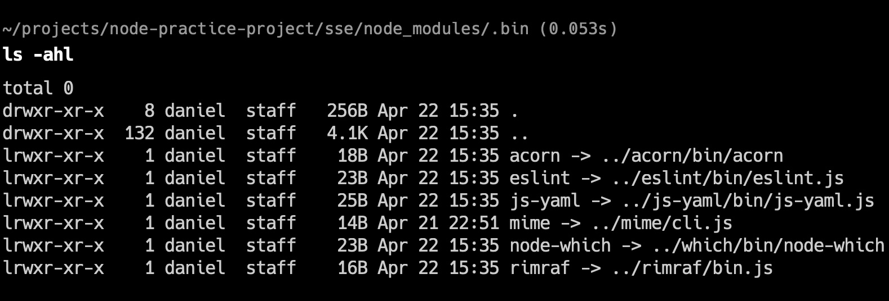

# 玩轉 npm script

## npm run-script

### 內建指令

npm run 實際上就是`npm run-script`的 alias，當你執行 npm run，他會列出`package.json`檔案在`scripts`裡面的所有指令。

npm run test 會執行 scripts 裡面的`test`指令，因為 test 是`npm run-script`內建的[指令之一](https://docs.npmjs.com/cli/v8/commands/npm-run-script)，所以可以縮寫成`npm test`，甚至是`npm t`(npm test 的 alias)，不是內建指令就必須把 run 乖乖的打出來，像`npm run echo`。

package.json

```json
"scripts": {
    "test": "echo \"Error: no test specified\" && exit 1",
    "echo": "echo $PATH"
}
```

### inject 環境變量

在 terminal 輸入`echo $PATH & npm run echo`，他會印出 PATH 的環境變量跟在 npm run-script 裡面的環境變量，如圖


你會發現多了好幾個 xxx/xxx/node_modules/.bin 的東西，這些環境變量就是在執行 npm run-script 的時候加上去的，執行完之後又移除。

他的規則，就是當下的目錄找不到該 modules 的 bin 就往`上一層目錄`找，直到`根目錄`，就也是 nodejs 引用 modules 的規則底層機制。

### .bin 執行檔

輸入`npm i eslint`安裝 eslint，安裝完之後，會發現在`./node_modules/.bin`多了幾個檔案，用`ls -alh`去看一下他的狀態，發現 eslint 他是一個`link`，指向`./node_modules/eslint/bin/eslint.js`的檔案。

安裝 package 的時候，會在/node_modules/.bin 裡面生成相對應的 link，該 link 會指向該 package 的`入口js檔案`，然後在執行 npm run-script 的時候，因為 inject 了.bin 的環境變量，所以可以在 npm run-script 裡面直接使用該 package。

使用 `bunx或是npx` <包名稱>，會先找./node_modules/.bin 裡面的檔案，可以透過這樣的方式去執行專案裡面安裝的套件



```json
"scripts": {
    "test": "echo \"Error: no test specified\" && exit 1",
    "echo": "echo $PATH",
    "lint": "eslint"
},
```

## npm run-script 的串行跟併行

-   串行：一個執行完，換下一個執行，符號是`&&`
-   並行：所有只有一起同時執行，符號是`&`

### 串行

有個 scripts 設定如下

```json
"scripts": {
    "lint:js": "eslint *.js",
    "lint:css": "stylelint *.less",
    "lint:json": "jsonlint --quiet *.json",
    "lint": "npm run lint:js && npm run lint:css && npm run lint:json"
},
```

<br/>

我們使用`&&`，把 npm run-script 串連起來，一個接著一個執行，就是`lint:js`執行完了換到`lint:css`執行，然後`lint:json`

### 併行

併行就是同時執行，只要把`&&`換成`&`就可以了，但是因為併行他是使用`子進程(subprocess)`來執行 npm run-script，假如沒下`wait`指令，`主進程`不會等所有`子進程全執行完`，後面沒指令他就 exit 跳出了，然後 watch 的`子進程也會被中斷`，設定如下。

```json
"scripts": {
    "lint:js": "eslint *.js",
    "lint:css": "stylelint *.less",
    "lint:json": "jsonlint --quiet *.json",
    "jest": "jest --watchAll",
    "test": "npm run lint:js & npm run lint:css & npm run lint:json & npm run jest & wait"
},
```

也可以使用`npm-run-all`package，讓代碼看起來更簡潔一點，加上`--parallel`代表是`併行`，沒加就是串行。

```bash
npm i npm-run-all -D
```

```json
"scripts": {
    "lint:js": "eslint *.js",
    "lint:css": "stylelint *.less",
    "lint:json": "jsonlint --quiet *.json",
    "jest": "jest --watchAll",
    "test": "npm-run-all --parallel lint:* jest & wait"
},
```

## pre & post scripts

這是讓你在執行某個 npm run-script`之前`跟`之後`，觸發 scripts，只要在該 script 的前面加上`pre`或是`post`就可以了，如下：

```json
"scripts": {
    "preecho":"echo a",
    "echo": "echo $PATH",
    "postecho":"echo b"
},
```

```bash
npm run echo
# 會先印出a, 在印出環境變量PATH, 在印出b
```

## 跨平台的 npm run-script 處理

### 原生寫法

linux-like 系統跟 windows 執行指令不一樣，所以不是`分別寫兩種 scripts`，針對 linux-like 系統跟 windows，就是透過套件幫你處理。如下面範例，設定環境變量除了要多個`set`之外，還要加上`&&`去連結指令，而且`不能有空白`

```json
"scripts": {
    "dev":"BASE=dev node index.js",
    "win-dev": "set BASE=dev&&node index.js"
},
```

### 套件寫法

安裝 cross-env 套件，然後在 scripts 前面加上 cross-env，他就會幫你處理 windows 平台設定環境變量的問題了。話說 cross-env 這套件是 kentcdodds 做的，2020 年底他就宣布不在維護了，github 上寫了兩個推薦的套件，結果比他這個還舊還不 active 是...xd

```bach
npm i cross-env
```

```json
"scripts": {
    "dev":"cross-env  BASE=dev node index.js"
},
```

其他類似的東西做個統整，如下：

-   cross-env：設定環境變量
-   rimraf：刪除檔案
-   cpr：複製檔案
-   make-dir-cli：建立資料夾

這些東西底層原理核心都是，用`process.arch`去判斷作業系統，`parse參數`，然後用`process.spawn`去執行命令

<Comment />
