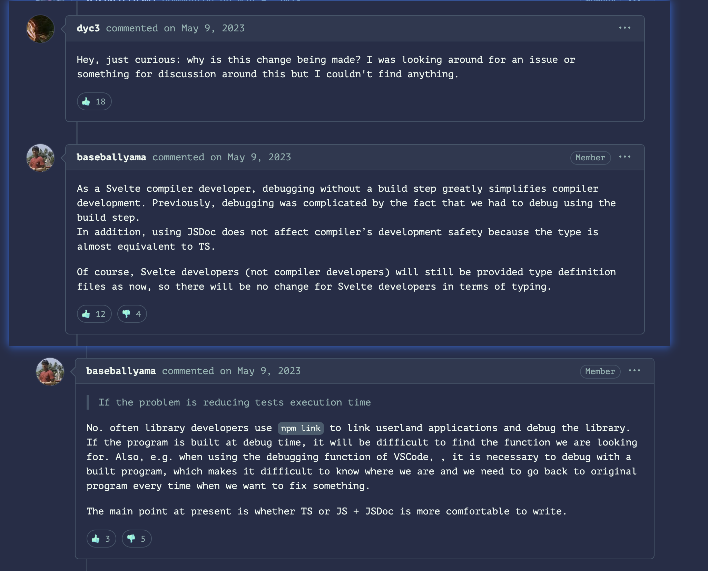
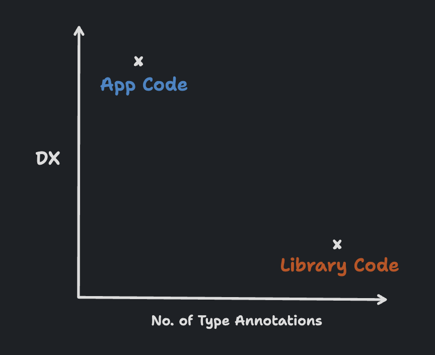
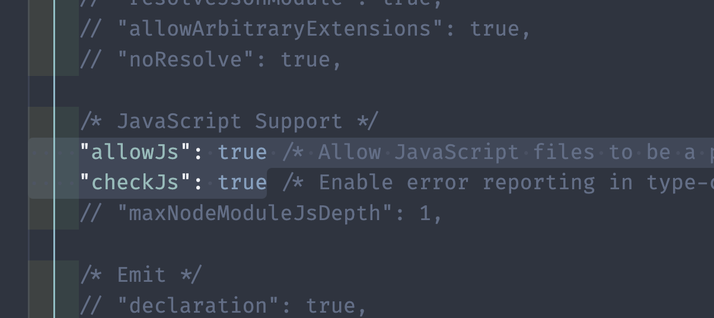
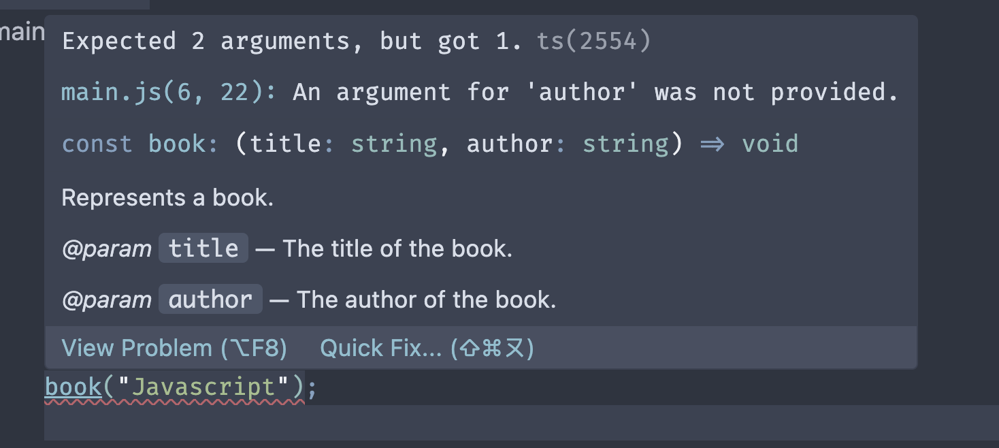

# JSDoc 取代 Typescript?

## 前言


如同`Kent C Dodds`所說，前端的趨勢，`Typescript`已經贏了，看前端的職缺，`Typescript`幾乎已經是必備。

然而在`2023`年，發生了兩件事，引起社群的高度關注：

-   [Sveltejs move from Typescript to Javascript with JSDoc](https://www.youtube.com/watch?v=q8UpdBt3J2M)
-   [Turbo 8 is dropping TypeScript](https://world.hey.com/dhh/turbo-8-is-dropping-typescript-70165c01)

`Sveltejs`是前端開發的明日之星，`Turbo 8`是 `Rails` 的 `Dom` 更新策略(類似 `island`)的核心庫。

兩個在 Web 開發比較前沿的技術，選擇放棄了`Typescript`，是不是 Typescript 不好，不行了？

社區很快地就發出了這樣的質疑跟疑問。

## JSDoc 是什麼？

在討論他們面臨的問題，為何選擇 JSDoc 的原因之前，先了解一下 JSDoc 是什麼。

### 原始含義

看一下 JSDoc 的官方 [Repository](https://github.com/jsdoc/jsdoc)的簡介：Javascript 的 `API 文件`產生器

-   An API documentation generator for JavaScript.

就是在代碼上面加上對應的`comment`，然後透過`jsdoc`指令去產生`文檔`

我們拿官方的範例，來弄個文檔

```js
// book.js

/**
 * Represents a book.
 * @constructor
 * @param {string} title - The title of the book.
 * @param {string} author - The author of the book.
 */
function Book(title, author) {
    console.log(`書的標題是${title}, 作者是${author}`)
}

Book('Javascript', 'Daniel')
```

執行`bunx jsdoc book.js`指令，會 generate 一個叫 out 的目錄

再打`bunx serve ./out`去對 out 目錄跑一個 web service。

用瀏覽器去瀏覽，就會看到以下的畫面。


就是個產生文檔的工具，

相關的寫法可以參考一下 JSDoc 的[官方文件](https://jsdoc.app/)

### TS 中的 JSDoc

我們看一下 Typescript 的[官方文件](https://www.typescriptlang.org/docs/handbook/jsdoc-supported-types.html#type)

-   The list below outlines which constructs are currently supported when using `JSDoc annotations` to provide type information in `JavaScript files`.
-   The meaning is usually the same, or a `superset`

簡單講就是，Typescript 中的 `「JSDoc」`使用的是原本 JSDoc 的 `annotations`

甚至還是`超集`，有多增加一些功能。(於 TS `v2.9` 時支持 JSDoc 功能)

謎底解開了，他們並`不是屏棄`了 Typescript，其實還在 Typescript 的`範疇`裡面。

在 Typescript 的生態中，使用了 JSDoc 的 `annotations`，

依舊能夠享受 Typescript 帶來的種種`好處`，`避免`他帶來的`缺點`。

## 面臨的問題

### Rich Harris 專訪

從`Rich Harris`的[Svelete 社群專訪](https://www.youtube.com/watch?v=q8UpdBt3J2M)中提到

使用 Typescript 除了需要`額外的工具`去 compile 之外

當你在不同的專案使用該 library，你沒辦法在 `node_modules` 裡面直接 `fiddle`(調適)

他需要一個額外的`build`的過程

他在自己的 twitter 也提到：`Typescript makes much less sense for library authors`


這邊有[原始訪問](https://www.youtube.com/watch?v=MJHO6FSioPI)

### Svelte repo 的問答

Svelete.js 官方 repo 有個[TS to JSDoc Conversion #8569](https://github.com/sveltejs/svelte/pull/8569)的 pull/request

有人問了相關問題，官方做了[回應](https://github.com/sveltejs/svelte/pull/8569#issuecomment-1540011903)



簡單講就是，身為一個 `compiler` 框架的開發者，用 Typescript 要 debug`麻煩`又`花時間`

library 的作者通常都會使用`npm link`，如果在 debug 時重新構建

有時不容易`定位`到該個 function

### Theo(t3․gg)的說法

另外一個 KOL，`Theo` 也有出個影片：[Svelte Broke Up With TypeScript??!](https://www.youtube.com/watch?v=gIBEnSIM7W4)

因為他也有弄個叫[t3 stack](https://github.com/t3-oss/create-t3-app)的東西，他能體會過程中的痛點

他提到，Typescript 對`開發者`而言，能夠提供`consistency`跟`reliability`

但是對框架`作者`而言

-   要保證 `typed contract` 的正確性
-   `npm package` 能夠發佈，符合使用者`開發`的各種需求

而做的各種 `type hack`，只有一個字 painful

他在影片的[3:37](https://youtu.be/gIBEnSIM7W4?si=U8NMElvEwAZkw4KQ&t=217)舉了一個複雜的`泛型`hack 的例子

對比用 JSDoc 寫的可讀性，就差蠻多的

他引用了[mattpocockuk](https://twitter.com/mattpocockuk)的一張圖，很生動 (原[推文在這](https://x.com/mattpocockuk/status/1655839184433627137?s=20))



`mattpocockuk` 是 typescript 的專家，要學 typescript 一定要 follow

他也有弄一個教學網站，[totaltypescript](https://www.totaltypescript.com/)

### DHH 的說法

在他那篇 blog：[Turbo 8 is dropping TypeScript](https://world.hey.com/dhh/turbo-8-is-dropping-typescript-70165c01)

其實論點都差不多，不過他有一段話蠻有趣的

> Not just because it requires an `explicit compile` step, but because it `pollutes` the code with `type gymnastics` that add ever so little joy to my development experience, and quite frequently considerable grief. Things that should be `easy become hard`, and things that are `hard become any`. No thanks!

`類型體操(type gymnastics)`，讓簡單的事變成困難，困難的事變成`any`

變成 any，笑死

ya, 即使在熱門框架中，像 Vue.js 也會用 any

## 如何套用 JSDoc

新建一個專案，然後把之前的範例貼進去，如下

```js
// main.js

/**
 * Represents a book.
 * @param {string} title - The title of the book.
 * @param {string} author - The author of the book.
 */
const book = (title, author, name) => {
    console.log(`書的標題是${title}, 作者是${author}`)
}

book('Javascript')
```

呼叫 book 函數時，根據 JSDoc 的註解，少了一個 author 參數

但是 ide 沒有`提示錯誤`

在命令行打 `bunx tsc --init`去產生`tsconfig.json`檔

然後把以下設定打開

-   `allowJs: true` // 允許編譯 JS
-   `checkJs: true` // JS 類型檢查



ide 就會有`紅色的波浪線`提示少了一個 author 參數，如圖



<Comment />
